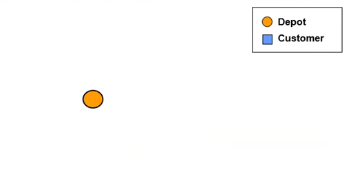
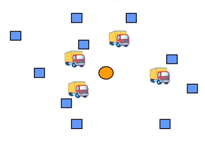
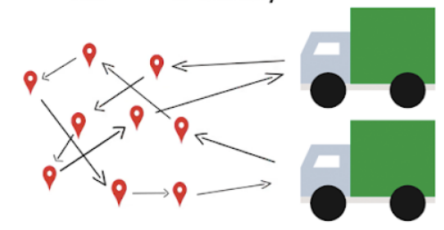
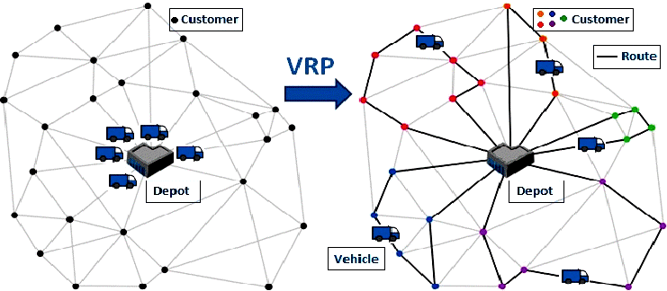
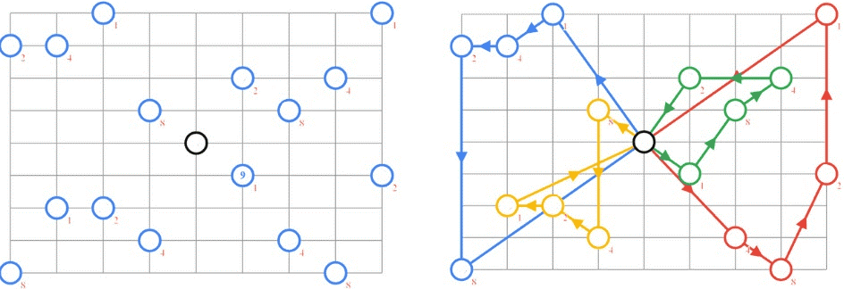

# **Problema de Enrutamiento VRP**

El presente trabajo parcial se basa en descubrir soluciones óptimas para el problema de enrutamiento de vehículos (VRP). Cuya definición hace referencia a un problema de optimización de carácter combinatorio y de programación de entero que busca hallar el conjunto rutas más óptima para una determinada flota de vehículos que debe satisfacer las demandas de un conjunto dado de clientes.

**Espacio de búsqueda**

Para el problema se tiene los siguientes pasos para describir el proceso de búsqueda.

- En primer lugar se tiene un nodo depósito (despot) que hará la función de origen y destino

- Con el pasar del tiempo se empieza a tener múltiples demandas y múltiples vehículos capacitados para satisfacer esas demandas.

 

- Luego, con el fin de satisfacer todos los pedidos en el menor tiempo posible, las rutas que los vehículos pueden tomar, puede verse muy diversificada, provocando retrasos y aumento de costo para solventar dichos retrasos.

### Por ende, el objetivo principal dentro de este problema, y el que tenemos que cumplir en este trabajo, es el de &quot;Minimizar el costo total (tiempo de viaje + costo de los vehículos + labor) o en algunos casos reducir de número de vehículos&quot;

ESTADO INCIAL----------------------------------------------POSIBLE ESTADO FINAL

### **Transiciones/acciones/reglas**

- Cada ruta empieza y termina en el depósito
- Cada nodo cliente es visitado por un vehículo
- La demanda total de clientes visitados por un vehículo, no debe exceder a la capacidad del vehículo

### Estructura de datos: Grafos

## Transiciones 
